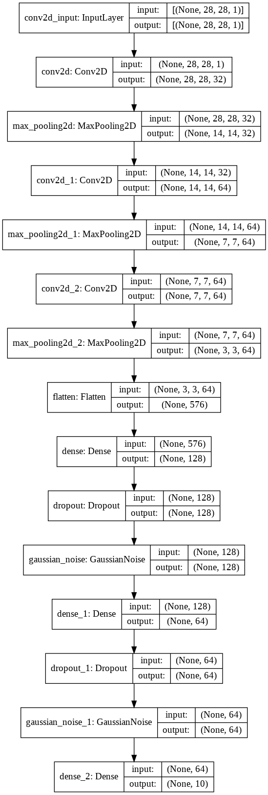

# Kannada MNIST

## Introduction

Kannada-MNIST: A new handwritten digits dataset for the Kannada language.

The goal of the competition is to provide a extension to the classic MNIST competition we're all familiar with. Instead of using Arabic numerals, it uses a dataset of Kannada digits.

Then, the goal is classify the digit image into the 10 possible classes (from 0 to 9).

## Dataset

- 60000 samples

## Used packages

- Tensorflow Keras
- Matplotlib
- Pandas
- Numpy

## Model

## Results

* Metric: Accuracy
	* 99.73% training set
	* 99.41% dev set
	* 97.43% test set
	* 77.45% harder test set
